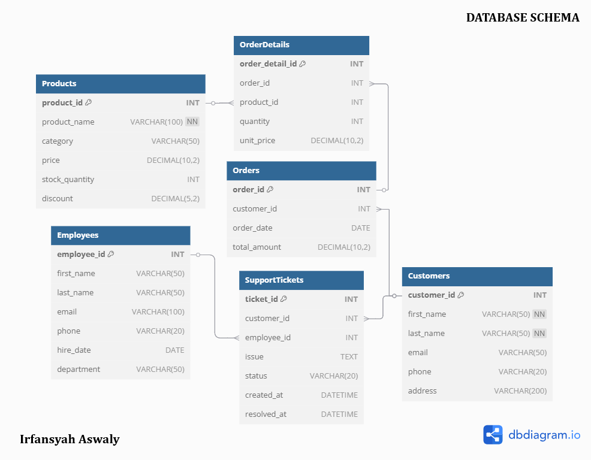

# 📊 TechCorp SQL Portfolio

This is a SQL portfolio that demonstrates data analysis on TechCorp's e-commerce database. The analysis focuses on customer orders, employee performance, product sales, and financial metrics.

## 📌 Project Description
TechCorp is an e-commerce company that specializes in electronic products such as laptops, smartphones, and accessories. As a **Data Analyst**, the goal of this project was to perform various business analyses using SQL, focusing on customer behaviors, employee performance, and product performance.

This repository contains SQL scripts used to analyze the business, including queries on customer orders, employee support ticket resolutions, product sales, and financial insights.

## 📂 Project Structure
📁 `TechCorp-SQL-Portfolio/`  
├── 📄 `create_tables.sql` - Script to create tables for the database.  
├── 📄 `insert_values.sql` - Script to insert sample data into the database.  
├── 📄 `queries.sql` - SQL queries to perform various business analysis.  
├── 📁 `images/` - Folder containing screenshots and visualizations.  
└── 📄 `README.md` - Documentation for the project.

## 🔍 Database Schema

## 📊 Data Analysis & Queries

### 1️⃣ **Top 3 Customers Based on Total Order Amount**
### 2️⃣ **Average Order Value for Each Customer**
### 3️⃣ **Employees with More Than 4 Resolved Support Tickets**
### 4️⃣ **Products That Have Never Been Ordered**
### 5️⃣ **Total Revenue**
### 6️⃣ **Average Price by Product Category**
### 7️⃣ **Customers Who Have Ordered More Than $1000**
